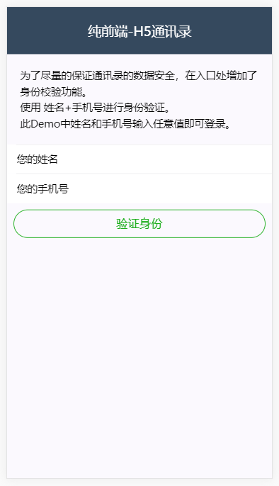

# phonebook

> A Simple h5 address book based on Vuejs and Vux
> 一个基于VueJs 及 VUX实现的简易H5 纯前端通讯录  
> Demo: [http://phonebook.roczhou.cn](http://phonebook.roczhou.cn)

## Description
功能简介

#### 1.登录校验
提供了基于姓名+手机号的身份校验，一定程度保护通讯录数据安全  
  
#### 2.通讯录查看
列表查看  
  
单人详情  
  
微信浏览器中，可以长按二维码获取通讯录直接保存至通讯录

#### 3.相册
简单相册功能（添加了图片懒加载）

## Build Setup

``` bash
# install dependencies
npm install

# serve with hot reload at localhost:8080
npm run dev

# build for production with minification
npm run build

npm run build --report
```

For a detailed explanation on how things work, check out the [guide](http://vuejs-templates.github.io/webpack/) and [docs for vue-loader](http://vuejs.github.io/vue-loader).
